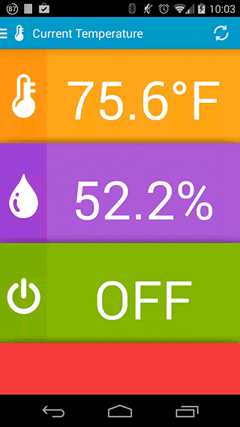
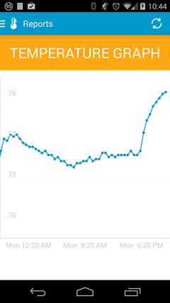

Temperature
===========
Temperature is a native Android app to view the temperature and humidity of my apartment. The current temperature and humidity are monitored by a [Spark Core](https://www.spark.io/) and recorded to a MySQL database via a cron job. Data requests from the app are made with [Retrofit](http://square.github.io/retrofit/). The graph is displayed using [AChartEngine](https://code.google.com/p/achartengine/) (a charting library for Android).

&nbsp;&nbsp;&nbsp;

Features
---------------------------
+ View the current temperature, humidity and wall AC status (on or off)
+ Reports showing historical temperature data for the past day

Third Party Libraries
---------------------------
+ [Retrofit](http://square.github.io/retrofit/) (used for API requests)
+ [Butterknife](http://jakewharton.github.io/butterknife/) (used for view injection)
+ [AChartEngine](https://code.google.com/p/achartengine/) (used to display the report graph)
+ [Cupboard](https://bitbucket.org/qbusict/cupboard) (will be used to cache data locally)
